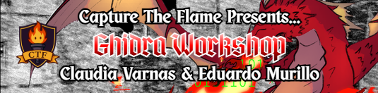
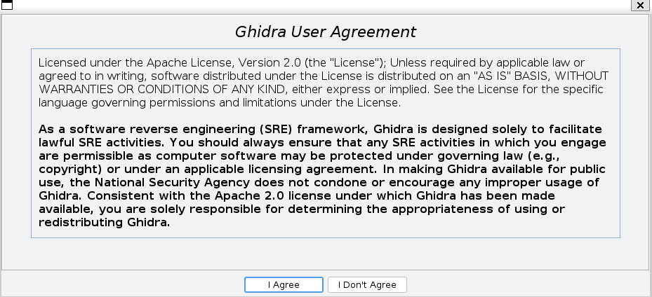

<div align="center">
    
</div>

---

Welcome to the **Taming the Dragon: Ghidra Workshop** repo! This workshop was made to showcase the NSA's decompiler Ghidra. 

The event featured three segments:
- Work through the *Demo* and *HelloWorld* files
- Have attendees work through the *Mockware* file
- Decompilation of WANNACRY

The files in this repo were intended for educational purposes of this workshop and were made to showcase Ghidra's capabilities.  

The workshop material and steps were transcribed below. If interested in Ghidra, please feel free to follow along.

## Table of Contents
1. [Installation](#installation)
2. [Demo](#Demo)
3. [Hello World](#HelloWorld)
4. [Mockware](#Mockware)
5. [WANNACRY](#WANNACRY)

--- 

<br>

### Installation

A follow along tutorial for the install can be found [here](https://youtu.be/oTD_ki86c9I?si=VWV_adW9MIuzDJX_&t=299)

**Step 1:** Go to the this repo: [Ghidra Repo](https://github.com/nationalsecurityagency/ghidra)

Scroll down to the *install* section and click the *release file* link. 

Ghidra doesn't change dramatially between versions, so any release year should be fine for this workshop. Make sure you download the **ghidra_xx.x.x_PUBLIC...** zip file **only**. You do **NOT** need the source code for this demo!

**Step 2:** Unzip Ghidra

Once unzipped, you can run ghidra in the terminal. Open the terminal and make sure to **cd** into the extraced folder and run: 
```
./ghidraRun
```

At this point, if you do not have java 21+ installed, you will get the following error:

**ERROR: The 'java' command could not be found in your PATH or with JAVA_HOME**  
**Please refer to the Getting Started document's Troubleshooting section.**

You can install java with the following command
```
sudo apt install openjdk-21-jdk
```

Now, you can run 
```
./ghidraRun
```
And if you are met with this screen, then you are all set for the demo!



### Demo

### HelloWorld

### Mockware


### WANNACRY

For the last portion of our workshop, we covered WANNACRY. To prevent unecessarily distributing a dangerous ransomware, we advised attendees to watch while the host works through the decompilation of the executable. 

**Note**: We did **not** distribute the ransomware used during this workshop. The sample analyzed was a publicly available version of the WANNACRY ransomware that can be found online. This workshop was strictly for educational and reverse engineering purposes using Ghidra. Attendees were advised to only download or analyze malware within an isolated and secure environment. Any interaction with malicious software is done **at your own risk**, and we are not responsible for any damage, data loss, or other issues resulting from its use.

